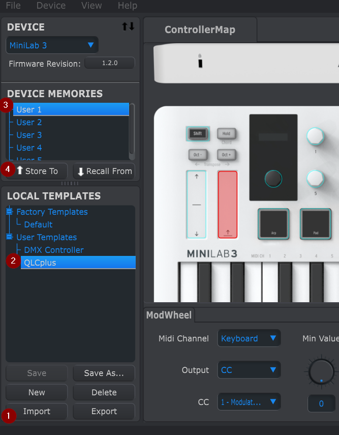

# Arturia Minilab 3 Input Profile for QLC+

🎹💡 QLC+ and MIDI profile to use the Arturia Minilab 3 as a lighting controller

This project provides a custom MIDI mapping and profile to use the Arturia Minilab 3 as a lighting controller with [QLC+](https://github.com/mcallegari/qlcplus). With this setup, you can control your lighting setup using the Minilab 3's knobs, pads, and keys.

## 📂 QLC+ Input Profile

Copy the minilab3.qxi file to your QLC+ Input Profiles directory.

### Linux

```sh
cp minilab3.qxi ~/.qlcplus/inputprofiles/
```
### Windows
```powershell
copy minilab3.qxi %HOMEPATH%\QLC+\InputProfiles\
```
### macOS
```sh
cp minilab3.qxi ~/Library/Application\ Support/QLC+/inputprofiles/
```

## 🎹 MIDI Control Center Profile

Using the Arturia [Midi Control Center](https://www.arturia.com/de/technology/mcc), the custom Profile can be loaded onto the Minilab 3 Controller. Unfortunately ths seems to be released only for Windows (maybe wine works, not tested), but is only necessary once.

Open the MIDI Control Center and install the profile as shown below:



Once loaded, select an empty User Profile on the device and hit `Store To` to save it on the device

By pressing `Shift` + `Prog` (Pad), the active profile can be changed on the controller.


The `DAW` profile on the controller can also be used, but in this case, the Pads won't work as they are on a different MIDI channel by default.


## 🛠️ Usage

Open QLC+ and navigate to the `Input/Output` tab.

In `profiles` select the Arturia Minilab 3 as your input profile.

The Inputs can be assigned in the `Virtual Console` as usual.